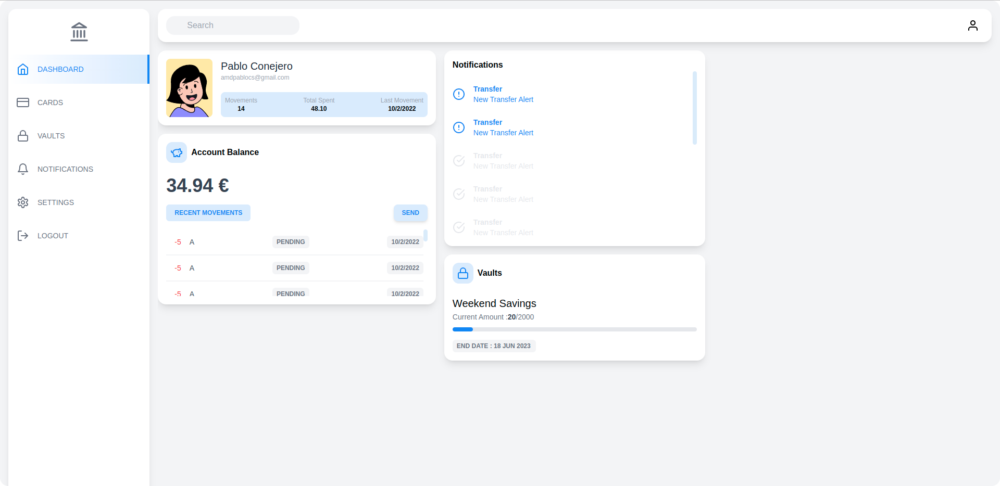

# Despliregue del Proyecto

## Introducción
Este proyecto está montado sobre React (Ionic) y Django Rest Framework, teniendo como base de datos sqlite 3 (por eso no hace falta desplegar un servicio de base de datos específico).

## React con Nginx
Para poder trabajar con React, se ha creado una multistage build de node (la versión 14 de node basada en alpine linux) y se ha desplegado con Nginx como segunda stage del dockerfile

## Django Rest Framework
Para desplegar django-rest-framework, se ha utilizado una imagen de python 3.10 sobre la cual se ha ejecutado el comando pip Install y se han instalado las dependencias necesarias.

## Análisis de dockerfiles

### I. React

En este dockerfile, se ha creado la imagen de nginx que contiene la aplicación de React, esta se ha construido mediante una multistage build, es decir existe una etapa del proyecto en la que se ha construido la versión de producción y otra parte en la que se ha puesto en el servidor web.

Para este proceso, se ha buscado la simplicidad absoluta, pues por eso este no contiene ningún archivo de los proyectos, directamente clona los repositorios y los mantiene actualizados.

Recalcar también que hay un paso intermedio en el proyecto donde se busca sobreescribir el archivo .env, el cual contiene la url del backend, buscando así la mayor modularidad de la app, y la menor complicación a la hora del despliegue.

### II. Django Rest Framework
Este dockerfile si que ha tenido un poco más de dificutad, pues este había que conseguir extraer un archivo con las dependencias del proyecto, y luego ejecutar el comando pip install, para que se instalen las dependencias necesarias.

Para poder extraer las dependencias, se ha utilizado una utilidad dentro de PyCharm para sincronizar todos las dependencias del proyecto.

En este caso, no se ha podido integrar una multistage build del proyecto debido a que la aplicación no se puede compilar de una manera óptima, pues para ello se requeriría del paquete Pyinstaller y utilizar una imágen basada en debian o alpine.

Siguiendo con la dinámica de la práctica, se ha buscado la mayor simplicidad del despliegue, por eso no existe ningún archivo del proyecto, y se clonan todos directamente desde los repositorios.

## Estructura del docker-compose
Para poder realizar todo el stack, se ha utilizado docker-compose, teniendo en cuenta las características del proyecto, se utilizarán dos servicios y una network, ya que no dependemos de una base de datos externa (faltaría un tercer servicio con redis, pero al no estar implementado del todo, no se va a utilizar).

Se han expuesto los puertos 80 y 6000(se expone este debido a que el uso de otras aplicaciones interfieren con el puerto 8000).

Se utilizará el siguiente comando para poder lanzar todo el stack

        sudo docker-compose up -d --build -f "docker-compose.yaml"

# Resultado

El resultado de esta práctica es el siguiente:

